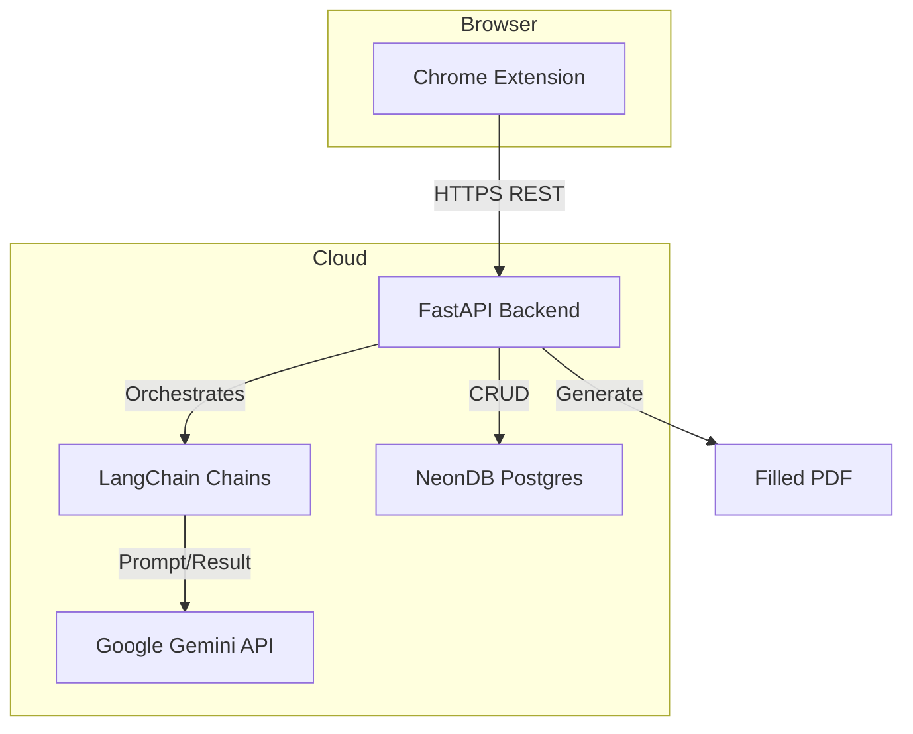

# PaperAmbulance 🚑
### Universal AI-Powered Form Assistant — Chrome Extension
> *"Duniya ka koi bhi form — PaperAmbulance bhar dega"*

PaperAmbulance is a state-of-the-art Chrome Extension designed to solve the complexity of filling out digital forms. Whether it's government schemes, bank applications, job portals, or scholarships, PaperAmbulance uses AI to automate the process, ensuring accuracy and efficiency.

---

## 🚀 The Core Workflow
1.  **Surveillance**: Visit any website with a form.
2.  **Detection**: The content script automatically scans and identifies input fields (labels, placeholders, names).
3.  **Intelligence**: Google Gemini (via LangChain) maps field semantics in both Hindi and English.
4.  **Execution**: The form is auto-filled in ~2 seconds from your securely stored universal profile.

---

## 🌟 Key Features

### 🔍 Universal Form Detection
Scans and understands all input fields on any website automatically. No manual configuration required per domain.

### 🤖 AI Field Mapping (LangChain + Gemini)
Uses a sophisticated LangChain orchestration to understand the *intent* behind fields (e.g., DOB, Aadhaar, Income) regardless of the language used on the site.

### 👤 One-Time Universal Profile
Fill your profile once (Name, Aadhaar, PAN, Address, Income, etc.) and store it securely in **NeonDB**. This profile is reused across every form forever.

### ⚠️ Smart Missing Document Alerts
Compares form requirements against your profile and highlights missing documents (e.g., "Income Certificate missing — click here to apply").

### 🎤 Hindi Voice Input
Supports hands-free profile updates using the Web Speech API and backend parsing to extract structured data from speech.

### 📄 PDF Export
Generates a filled PDF of any form for offline or print submission at government offices using ReportLab.

---

## 🛠 Technology Stack

| Layer | Technology | Purpose |
| :--- | :--- | :--- |
| **Frontend** | React (Vite) | Popup UI & Content Scripts |
| **Browser** | Chrome Extension MV3 | Core extension architecture |
| **Backend** | FastAPI (Python) | REST API for AI, Database, and PDF logic |
| **AI Orchestration**| LangChain | Managing complex AI chains |
| **AI Model** | Google Gemini | Semantic field understanding (Multi-lingual) |
| **Database** | NeonDB (Postgres) | Secure, serverless profile storage |
| **Voice Input** | Web Speech API | Hindi voice-to-text integration |
| **PDF Generation** | ReportLab | Exporting docs for offline use |

---

## 🏗 System Architecture

## 📋 Build Roadmap (Phase 1 Focus)
- **Setup**: Initialize Chrome Extension boilerplate and FastAPI backend.
- **Form Analysis**: Implement `FormAnalysisChain` to extract field intent.
- **Auto-Fill**: Develop injection logic for the content script.
- **Profile Management**: Build the React popup for secure data entry.
